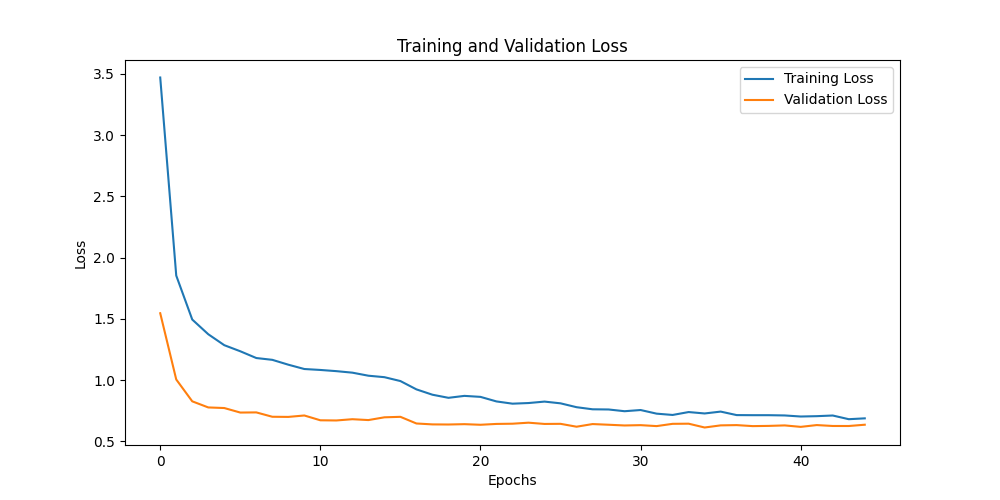
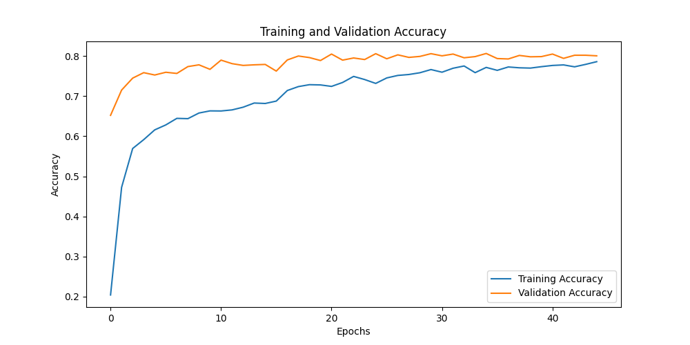
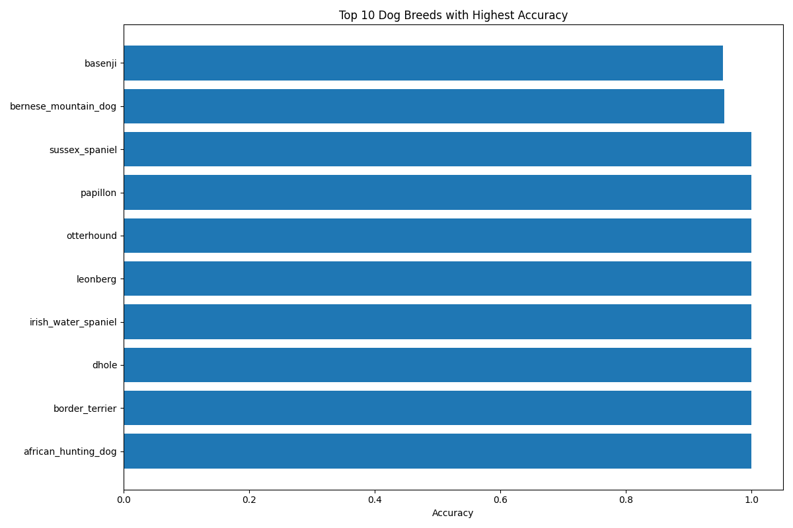
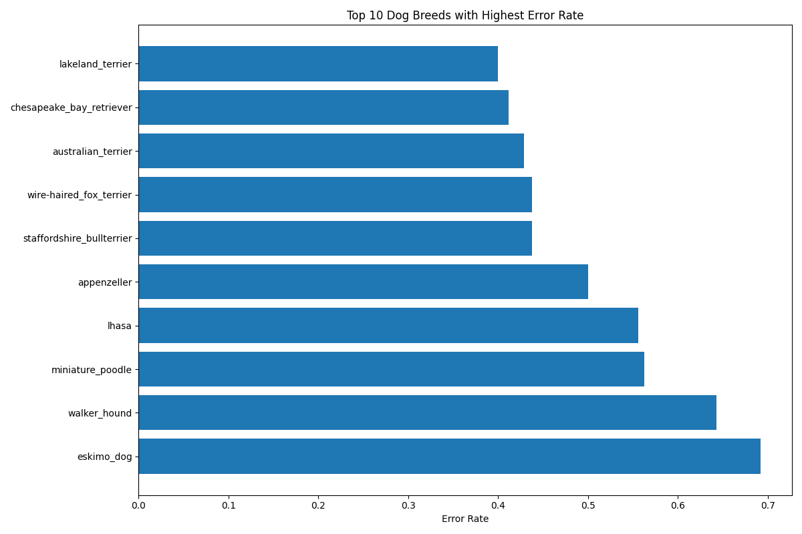
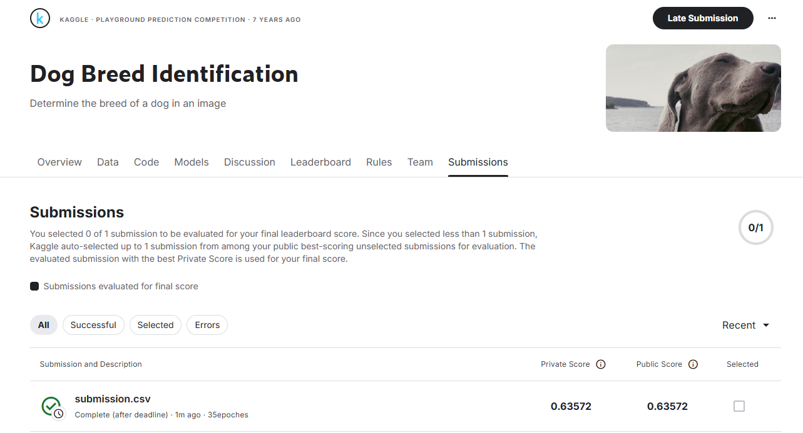
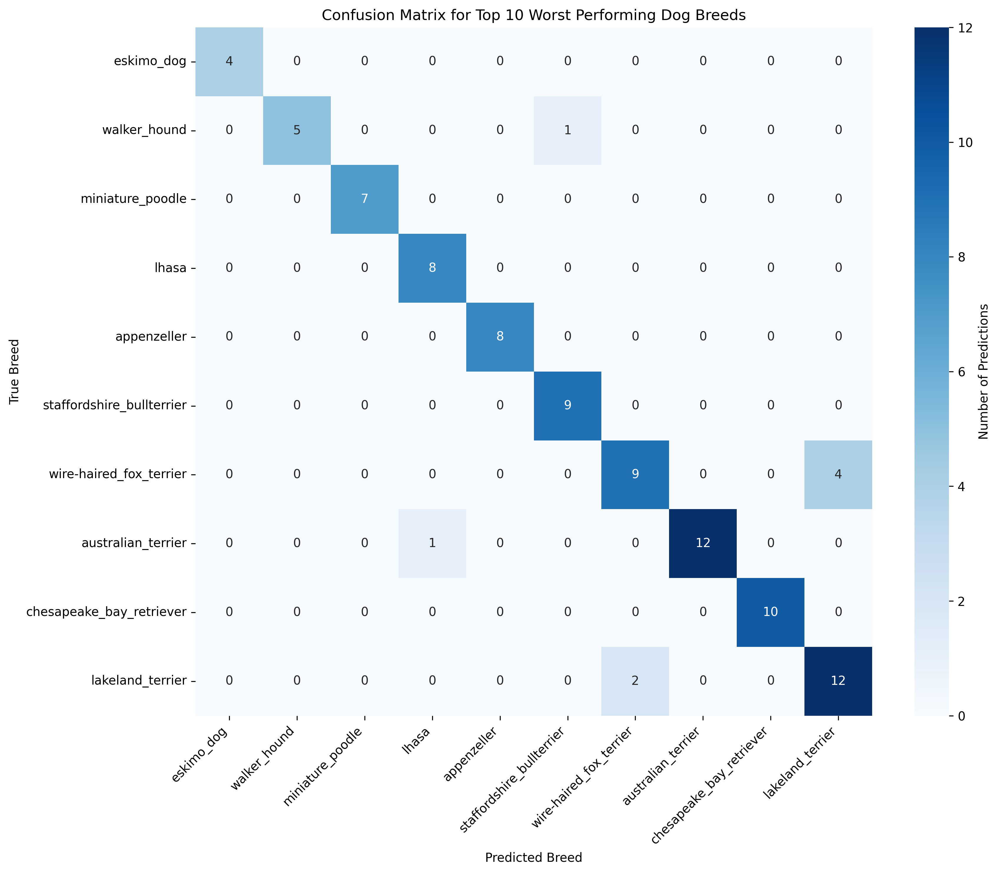

# 犬種辨識分類器

* [資料集下載與準備](#資料集下載與準備)
* [專案概覽](#專案概覽)
* [解決方案](#解決方案)
* [使用方式](#使用方式)
* [專案檔案說明](#專案檔案說明)
* [效能分析](#效能分析)


## 資料集下載與準備

1. 前往 Kaggle 競賽頁面：https://www.kaggle.com/competitions/dog-breed-identification/data
2. 點擊「Download All」按鈕下載資料集（需要 Kaggle 帳號）
3. 將下載的 zip 檔案解壓縮到專案根目錄
4. 確認檔案結構如下：
   - `train/` - 包含訓練圖片
   - `test/` - 包含測試圖片
   - `labels.csv` - 訓練標籤
   - `sample_submission.csv` - 提交範例格式


本專案是一個使用 PyTorch 框架與預訓練 ResNet-50 模型實現的深度學習（CNN）圖像分類器，用於辨識 120 種不同的犬種。

## 專案概覽

本專案的主要目標是從圖像中準確預測犬種。資料集包含 120 種不同的犬種，競賽任務是建立一個能夠從照片中判斷犬隻品種的分類器。

## 解決方案

### 模型架構
本專案採用遷移學習的策略，並對預訓練模型進行調整以適應犬種辨識任務：
- **基礎模型**：使用在 ImageNet 資料集上預訓練的 ResNet-50 模型。ResNet-50 以其深度殘差學習框架聞名，能夠有效訓練非常深的網路並解決梯度消失問題。
- **頂層修改**：移除了原 ResNet-50 的最後一個全連接層（通常用於 ImageNet 的 1000 類別分類），並替換為一個新的分類頭。這個新的分類頭包含：
    - 一個線性層，將 ResNet-50 提取的特徵從 `in_features` 2048 映射到 512 維。
    - 一個 ReLU 激活函數，引入非線性。
    - 一個 Dropout 層（p=0.5），用於正則化，減少過度擬合。
    - 最後一個線性層，將 512 維特徵映射到 `num_classes` 120個犬種。
- **遷移學習與微調**：
    - **特徵提取**：為了保留預訓練模型學習到的通用圖像特徵，ResNet-50 的大部分卷積層的權重被凍結（`param.requires_grad = False`），使其在訓練初期不進行更新。具體來說，除了最後 20 組參數（主要對應較高層的卷積層和新的分類頭）之外的所有參數都被凍結。

   ```python
   for param in list(self.model.parameters())[:-20]:
      param.requires_grad = False
   ```

    - **微調**：新加入的分類頭以及 ResNet-50 模型中未被凍結的較高層級的參數則進行訓練，使其適應犬種分類的特定任務。這種策略允許模型利用預訓練的知識，同時針對新任務進行優化。

### 資料增強
為了提升模型泛化能力，使用了以下資料增強技術：
- 隨機水平翻轉
- 隨機旋轉
- 亮度、對比度和飽和度調整

### 訓練策略
- 交叉熵損失函數
- Adam 優化器，針對不同層級設定不同學習率
- 學習率排程器：ReduceLROnPlateau
- 提早停止：若驗證準確度連續 10 個 epoch 未提升則停止訓練
- 每 5 個 epoch 定期儲存模型

## 使用方式

1. 確認 `train`、`test` 資料夾和 `labels.csv` 檔案位於正確路徑
2. 安裝所需套件：
```
pip install torch torchvision numpy pandas matplotlib scikit-learn tqdm pillow
```
3. 執行訓練與預測：
```
python dog_breed_classifier.py
```
4. 訓練完成後，將會產生以下檔案：
   - `best_model.pth`：最佳模型權重
   - `model/model_epoch_*.pth`：每 5 個 epoch 儲存的模型
   - `src/images/`：視覺化結果，包含：
     - 損失與準確度曲線
     - 表現最佳與最差犬種的範例
     - 效能摘要
   - `submission.csv`：預測結果（用於提交）

## 專案檔案說明

| 檔案名稱 | 說明 |
|---------|------|
| `dog_breed_classifier.py` | 主要程式碼，包含資料處理、模型定義、訓練與預測流程 |
| `README.md` | 專案文件，提供概覽、使用方式與結果說明 |
| `Changelog.md` | 變更日誌，記錄模型版本與改善歷史 |
| `requirements.txt` | 相依性列表，指定所需的 Python 套件版本 |
| `best_model.pth` | 已訓練的模型權重檔案，儲存驗證準確度最高的模型參數 |
| `src/images/accuracy_curve.png` | 訓練準確度曲線，顯示準確度隨 epoch 變化的情況 |
| `src/images/loss_curve.png` | 訓練損失曲線，顯示損失隨 epoch 變化的情況 |
| `src/images/best_*` | 準確度最高的前 10 種犬種的視覺化結果 |
| `src/images/worst_*` | 錯誤率最高的前 10 種犬種的視覺化結果 |
| `src/images/performance_summary.txt` | 文字檔案，包含訓練摘要與效能分析 |
| `model/model_epoch_*.pth` | 訓練過程中每 5 個 epoch 儲存的模型檢查點 |
| `firstSubmission.png` | 提交結果圖片，顯示在 Kaggle 上的提交分數 |
| `labels.csv` | 訓練集標籤檔案，包含每張圖片的 ID 與對應的品種 |
| `sample_submission.csv` | Kaggle 提供的提交範例格式 |
| `submission.csv` | 模型預測產生的提交檔案，用於 Kaggle 評分 |
| `.gitignore` | Git 版本控制忽略設定，排除不必要的檔案 |

## 效能分析

訓練過程包含提早停止機制以防止過度擬合。若驗證準確度連續 10 個 epoch 未提升，訓練將會提早停止。訓練完成後，詳細的效能摘要會儲存至 `src/images/performance_summary.txt`。


### 訓練過程

訓練過程中的損失曲線：



訓練過程中的準確度曲線：


### 效能分析

訓練完成後，我們分析了模型在驗證集上的表現：

#### 表現最佳的犬種
模型在這些犬種上達到最高的準確度：



各種表現最佳犬種的範例圖片，顯示正確的分類結果：
（請參閱 `src/images/best...` 目錄中的個別犬種圖片）

for example:


#### 表現最差的犬種
模型在這些犬種上表現最差：



for example:


各種表現最差犬種的範例圖片，顯示錯誤的分類結果：
（請參閱 `src/images/worst...` 目錄中的個別犬種圖片）

### 提交結果

提交至 Kaggle 的預測結果：

 

Cross Entropy Loss = 0.63572 (越小越好)

### 分析

#### 表現最差的犬種confusion matrix



#### 表現最差的犬種heatmap

